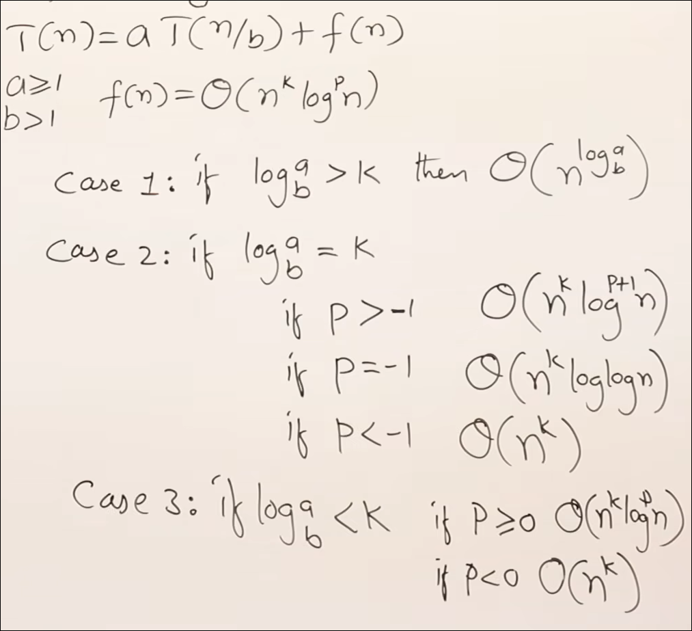

# Master’s Theorem

Master’s Theorem is used to solve divide-and-conquer recurrences of the form:

```text
T(n) = aT(n/b) + f(n)
```

where:

```text
a ≥ 1, b > 1
```

- `a` = number of subproblems
- `n/b` = size of each subproblem
- `f(n)` = work done outside recursive calls

---

## Screenshot Reference



---

## Standard Master Theorem Cases

Let:

```text
T(n) = aT(n/b) + f(n)
```

Compare `f(n)` with:

```text
n^(log_b a)
```

---

## Case 1 — Recursive work dominates

If:

```text
f(n) = O(n^(log_b a - ε)) for some ε > 0
```

Then:

```text
T(n) = Θ(n^(log_b a))
```

Meaning: leaf/recursive part dominates.

---

## Case 2 — Balanced work

If:

```text
f(n) = Θ(n^(log_b a))
```

Then:

```text
T(n) = Θ(n^(log_b a) log n)
```

Meaning: every level contributes roughly equal work.

More general version:

If:

```text
f(n) = Θ(n^(log_b a) log^k n)
```

Then:

```text
T(n) = Θ(n^(log_b a) log^(k+1) n)
```

---

## Case 3 — Root work dominates

If:

```text
f(n) = Ω(n^(log_b a + ε)) for some ε > 0
```

and the regularity condition holds:

```text
a f(n/b) ≤ c f(n) for some c < 1
```

Then:

```text
T(n) = Θ(f(n))
```

Meaning: non-recursive work at the root/top levels dominates.

---

## Quick Exam Method

For:

```text
T(n) = aT(n/b) + f(n)
```

Steps:

```text
1. Identify a, b, and f(n).
2. Compute n^(log_b a).
3. Compare f(n) with n^(log_b a).
4. Apply Case 1, 2, or 3.
```

---

## Examples

### Example 1

```text
T(n) = 2T(n/2) + n
```

Here:

```text
a = 2, b = 2, f(n) = n
n^(log_b a) = n^(log_2 2) = n
```

So:

```text
f(n) = Θ(n^(log_b a))
```

Case 2:

```text
T(n) = Θ(n log n)
```

---

### Example 2

```text
T(n) = T(n/2) + 1
```

Here:

```text
a = 1, b = 2, f(n) = 1
n^(log_b a) = n^(log_2 1) = n^0 = 1
```

Case 2:

```text
T(n) = Θ(log n)
```

---

### Example 3

```text
T(n) = 4T(n/2) + n
```

Here:

```text
a = 4, b = 2, f(n) = n
n^(log_b a) = n^(log_2 4) = n²
```

Since:

```text
f(n) = n = O(n²⁻ε)
```

Case 1:

```text
T(n) = Θ(n²)
```

---

### Example 4

```text
T(n) = 2T(n/2) + n²
```

Here:

```text
a = 2, b = 2, f(n) = n²
n^(log_b a) = n
```

Since:

```text
f(n) = n² = Ω(n^(1+ε))
```

Case 3:

```text
T(n) = Θ(n²)
```

---

## Common Mistakes

- Forgetting to compute `n^(log_b a)`.
- Comparing `a` directly with `f(n)` instead of comparing `f(n)` with `n^(log_b a)`.
- Applying Master’s Theorem to recurrences like `T(n) = T(n-1) + n`; Master’s Theorem does not apply there.
- Forgetting the extra `log n` in Case 2.
