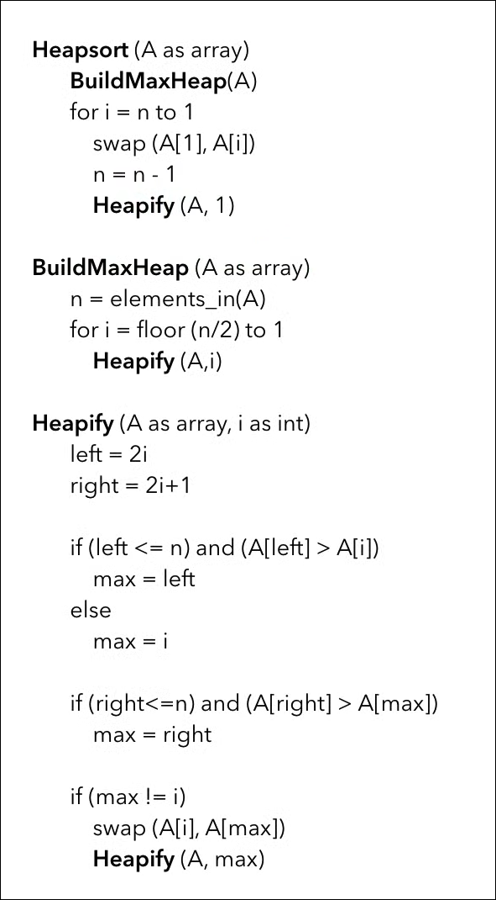

# 07 — Heap and Heap Sort

## 1. Heap Definition

A heap is a complete binary tree that satisfies a heap property.

### Max Heap

Every parent is greater than or equal to its children.

```text
parent ≥ children
```

### Min Heap

Every parent is less than or equal to its children.

```text
parent ≤ children
```

---

## 2. Array Representation

For 0-based indexing:

```text
left child  = 2i + 1
right child = 2i + 2
parent      = (i - 1) / 2
```

For 1-based indexing, as used in many exam pseudocodes:

```text
left child  = 2i
right child = 2i + 1
parent      = floor(i / 2)
```

---

## Screenshot Reference

The following screenshot uses **1-based indexing**:



---

## 3. Helper Function: Max-Heapify

Used when a node may violate max-heap property, but its children are already heaps.

```text
MaxHeapify(A, n, i):
    largest = i
    left = 2i + 1
    right = 2i + 2

    if left < n and A[left] > A[largest]:
        largest = left

    if right < n and A[right] > A[largest]:
        largest = right

    if largest != i:
        swap A[i], A[largest]
        MaxHeapify(A, n, largest)
```

Complexity:

```text
O(log n)
```

---

## 4. Helper Function: Build Max Heap

```text
BuildMaxHeap(A, n):
    for i = n/2 - 1 downto 0:
        MaxHeapify(A, n, i)
```

Complexity:

```text
O(n)
```

---

## 5. Main Algorithm: Heap Sort

```text
HeapSort(A, n):
    BuildMaxHeap(A, n)

    for i = n-1 downto 1:
        swap A[0], A[i]
        MaxHeapify(A, i, 0)
```

---

## 6. Insert and Delete-Max Algorithms

### Helper Function: Insert in Max Heap

```text
Insert(A, key):
    increase heap size by 1
    place key at the last position
    i = last index

    while i > 0 and A[parent(i)] < A[i]:
        swap A[i], A[parent(i)]
        i = parent(i)
```

### Helper Function: Delete Maximum

```text
DeleteMax(A):
    maxValue = A[0]
    A[0] = A[last]
    decrease heap size by 1
    MaxHeapify(A, heapSize, 0)
    return maxValue
```

---

## 7. C++ Implementation

```cpp
void maxHeapify(vector<int>& a, int n, int i) {
    int largest = i;
    int left = 2 * i + 1;
    int right = 2 * i + 2;

    if (left < n && a[left] > a[largest]) largest = left;
    if (right < n && a[right] > a[largest]) largest = right;

    if (largest != i) {
        swap(a[i], a[largest]);
        maxHeapify(a, n, largest);
    }
}

void buildMaxHeap(vector<int>& a) {
    int n = a.size();
    for (int i = n / 2 - 1; i >= 0; i--) {
        maxHeapify(a, n, i);
    }
}

void heapSort(vector<int>& a) {
    int n = a.size();
    buildMaxHeap(a);

    for (int i = n - 1; i >= 1; i--) {
        swap(a[0], a[i]);
        maxHeapify(a, i, 0);
    }
}

void insertMaxHeap(vector<int>& heap, int key) {
    heap.push_back(key);
    int i = heap.size() - 1;

    while (i > 0) {
        int parent = (i - 1) / 2;
        if (heap[parent] >= heap[i]) break;
        swap(heap[parent], heap[i]);
        i = parent;
    }
}

int deleteMax(vector<int>& heap) {
    if (heap.empty()) return -1;

    int maxValue = heap[0];
    heap[0] = heap.back();
    heap.pop_back();

    if (!heap.empty()) {
        maxHeapify(heap, heap.size(), 0);
    }

    return maxValue;
}
```

---

## 8. Complexity

| Operation | Complexity |
|---|---|
| Heapify | `O(log n)` |
| Build Heap | `O(n)` |
| Insert | `O(log n)` |
| Delete Max | `O(log n)` |
| Heap Sort | `O(n log n)` |
| Extra Space | `O(1)` |

---

## 9. Exam Perspective

Common PYQs:

- Convert given array into max heap.
- Perform insert/delete-max.
- Apply heap sort step by step.
- Write algorithms for heapify, build heap, heap sort.
- Analyze complexity.

---

## Practice

1. Build max heap from `[15, 19, 10, 7, 17, 6]`.
2. Perform heap sort on `[15, 19, 10, 7, 17, 6]`.
3. Why is Build Heap `O(n)` and not `O(n log n)`?

---

## Practice Solutions

### 1. Build max heap from `[15, 19, 10, 7, 17, 6]`

Initial array:

```text
[15, 19, 10, 7, 17, 6]
```

Tree:

```text
        15
      /    \
    19      10
   /  \    /
  7   17  6
```

After building max heap:

```text
[19, 17, 10, 7, 15, 6]
```

Tree:

```text
        19
      /    \
    17      10
   /  \    /
  7   15  6
```

### 2. Heap sort on `[15, 19, 10, 7, 17, 6]`

Build max heap:

```text
[19, 17, 10, 7, 15, 6]
```

Delete/extract max repeatedly:

```text
[17, 15, 10, 7, 6, 19]
[15, 7, 10, 6, 17, 19]
[10, 7, 6, 15, 17, 19]
[7, 6, 10, 15, 17, 19]
[6, 7, 10, 15, 17, 19]
```

Final sorted array:

```text
[6, 7, 10, 15, 17, 19]
```

### 3. Why Build Heap is `O(n)` and not `O(n log n)`

Not all nodes move down `log n` levels. Most nodes are near the leaves and move very little. The total heapify work over all nodes sums to:

```text
O(n)
```

So Build Heap is tighter than the loose bound `O(n log n)`.

